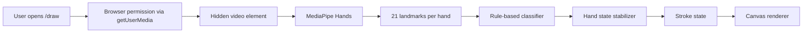

# Architecture

Author: Saad Kamal

Skywrite is a client-only React app. Its core loop is intentionally small: capture a camera frame, infer hand landmarks, classify a gesture, update drawing state, and render layered canvases.

## Runtime Pipeline

## Canvas Layers

Skywrite uses three full-screen canvas layers:

- Camera canvas: mirrored camera preview at reduced opacity.
- Drawing canvas: committed strokes plus active strokes.
- UI canvas: hand skeletons, cursors, arming rings, erase overlays, and HUD text.

This keeps the render code understandable and makes it easy to change a layer without coupling it to camera capture or gesture recognition.

## Gesture Classification

Gesture classification lives in `src/lib/gestures.ts`. It compares fingertip distance from the wrist against the matching PIP joint distance. That wrist-relative approach is simple, fast, and less dependent on screen orientation than a pure Y-axis check.

The classifier returns one of:

- `idle`
- `draw`
- `move`
- `erase`

`src/lib/Hand.ts` stabilizes that raw mode over consecutive frames so brief landmark jitter does not create accidental strokes or sudden state switches.

## Camera Lifecycle

The drawing page requests camera access when `/draw` opens. This matches the original Skywrite interaction model while still relying on the browser's explicit permission prompt.

MediaPipe is initialized only after camera permission is granted and the hidden video element has a usable frame. This order keeps permission failures, hardware failures, and local hand-tracking runtime failures diagnosable.

When users click `Stop Camera`, Skywrite:

- Stops the MediaPipe frame loop.
- Closes the MediaPipe `Hands` instance.
- Stops every `MediaStreamTrack`.
- Clears the hidden video source.
- Resets transient hand state.

That lifecycle is important because a visual camera toggle is not enough; the browser hardware indicator should reflect the actual capture state.

## Static MediaPipe Assets

MediaPipe model and WASM files are installed from npm. The Vite plugin in `vite.config.ts` copies them into `public/vendor/mediapipe/hands` for local development and production builds.

The app uses `locateFile` to resolve those self-hosted files. This avoids executing MediaPipe scripts from a third-party CDN at runtime.

## Important Files

- `src/pages/DrawingApp.tsx`: drawing session runtime
- `src/pages/CameraCalibration.tsx`: camera diagnostics
- `src/pages/GestureTutorial.tsx`: interactive gesture guide
- `src/lib/Hand.ts`: per-hand state and stabilization
- `src/lib/gestures.ts`: gesture classifier
- `src/lib/canvas.ts`: canvas rendering helpers
- `src/lib/transform.ts`: camera-to-canvas coordinate transforms
